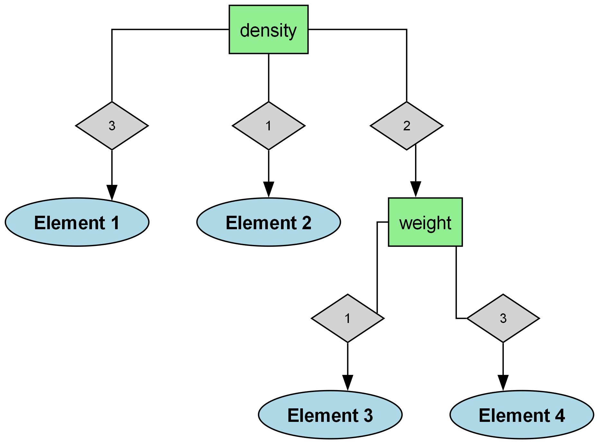

# FlowchartPlatform

FlowchartPlatform is a comprehensive web-based tool that generates intelligent flowcharts from structured data using decision tree algorithms. The platform combines machine learning concepts with interactive visualization to create decision flowcharts that help classify elements based on their attributes.

## Overview

The system consists of a FastAPI backend that handles data processing and flowchart generation, along with a web frontend for user interaction. FlowchartPlatform uses information theory principles (entropy and information gain) combined with user-defined priorities to build optimal decision trees, which are then visualized as orthogonal flowcharts.



---

## Features

### Core Functionality
- **Intelligent Decision Trees**: Uses entropy and information gain to build optimized decision trees
- **Priority-Based Decision Making**: Apply custom weights to attributes to influence the decision path
- **Orthogonal Flowchart Visualization**: Generates clean, professional flowcharts with orthogonal connectors
- **Multiple Export Formats**: Generate flowcharts in PNG (adjustable quality) or SVG format
- **Classification Accuracy**: Automatic calculation of the decision tree's classification accuracy

### Technical Features
- **Async Processing**: Handles requests asynchronously using a worker pool system
- **Real-time Updates**: Delivers progress and results via Server-Sent Events (SSE)
- **Parallel Processing**: Utilizes multiple worker processes for scalable performance
- **Thread-safe Data Handling**: Ensures consistent results with shared memory management
- **Tree Optimization**: Automatically prunes decision trees to simplify visualization

---

## Architecture

### Backend (`/backend`)
- FastAPI application with asynchronous request handling
- Decision tree algorithm with information gain calculation
- Graphviz integration for flowchart generation
- Worker process management for parallel processing

### Frontend (`/frontend`)
- HTML/CSS/JavaScript interface for submitting data and displaying results
- Real-time updates using Server-Sent Events
- Interactive flowchart display

---

## Installation

1. **Clone the repository**:
   ```bash
   git clone https://github.com/yourusername/FlowchartPlatform.git
   cd FlowchartPlatform
   ```

2. **Install backend dependencies**:
   ```bash
   cd backend
   pip install -r requirements.txt
   ```

3. **Install Graphviz** (required for flowchart generation):
   - **Windows**: Download and install from [Graphviz.org](https://graphviz.org/download/), ensure it's in your PATH
   - **macOS**: `brew install graphviz`
   - **Linux**: `sudo apt-get install graphviz` (Ubuntu/Debian) or equivalent

4. **Start the backend server**:
   ```bash
   cd backend
   python main.py
   ```
   By default, the server will run on `http://0.0.0.0:8080`

5. **Access the frontend**:
   Open `frontend/index.html` in a web browser or serve it using a local HTTP server.

---

## Usage Guide

### Creating a Flowchart

1. **Prepare your data**:
   - Identify the elements/items you want to classify
   - Define attributes that describe these elements
   - Organize data as a collection of elements with attribute values

2. **Configure the request**:
   - List all attributes as a comma-separated string (e.g., "color,shape,texture")
   - Assign priorities to attributes (e.g., "color:2.5,shape:1.0,texture:1.5") 
   - Set a priority threshold for attribute selection
   - Choose export format (PNG or SVG) and quality

3. **Submit the data** through the frontend interface or API endpoint

4. **Receive and analyze** the resulting flowchart and accuracy score

### API Endpoints

#### 1. Generate Flowchart

**Endpoint**: `/generate_flowchart`  
**Method**: POST  
**Description**: Submits a request to generate a flowchart

**Request Body**:
```json
{
  "attributes": "attribute1,attribute2,attribute3",
  "priorities": "attribute1:1.5,attribute2:2.0,attribute3:1.0",
  "threshold": 1.5,
  "data": [
    {
      "Element": "Element1",
      "attributes": {
        "attribute1": "value1",
        "attribute2": "value2",
        "attribute3": "value3"
      }
    },
    {
      "Element": "Element2",
      "attributes": {
        "attribute1": "value4",
        "attribute2": "value5",
        "attribute3": "value6"
      }
    }
  ],
  "export_format": "png",
  "png_quality": 300
}
```

**Response**:
```json
{
  "request_id": "550e8400-e29b-41d4-a716-446655440000",
  "message": "Request queued for processing"
}
```

#### 2. Get Processing Result

**Endpoint**: `/sse_result/{request_id}`  
**Method**: GET  
**Description**: SSE endpoint that streams updates about the processing status and results

**Response Events**:
- `processing`: Indicates the request is still being processed
- `result`: Returns the completed flowchart and accuracy information
- `error`: Returns error details if processing failed

---

## Algorithm Details

### Decision Tree Building

The algorithm follows these steps:
1. Calculate entropy for the target classification
2. For each attribute:
   - Calculate information gain
   - Apply priority weighting to information gain
3. Select the attribute with the highest weighted information gain
4. Split the dataset by the selected attribute
5. Recursively apply the process to each subset
6. Prune single-item chains to simplify the tree

### Flowchart Generation

The flowchart is generated using Graphviz with the following features:
- Rectangle nodes for decision points (attributes)
- Diamond nodes for attribute values
- Ellipse nodes for classification results
- Color coding to indicate priority level (yellow for high priority)
- Orthogonal connectors for clean presentation

---

## Performance Considerations

- **Worker Processes**: Adjust `NUM_WORKERS` in `backend/main.py` based on your CPU capabilities
- **Memory Usage**: Large datasets with many attributes may require more memory
- **Image Quality**: Higher PNG quality settings will increase response size
- **Complexity**: Very deep or wide trees may produce complex visualizations

---

## Contributing

1. Fork the repository
2. Create a feature branch (`git checkout -b feature/your-feature-name`)
3. Make your changes
4. Run tests if available
5. Commit your changes (`git commit -m 'Add some feature'`)
6. Push to the branch (`git push origin feature/your-feature-name`)
7. Open a Pull Request

---

## License

This project is available under the MIT License. See LICENSE file for details.

---

## Acknowledgments

- The decision tree algorithm is inspired by classic ID3 and C4.5 algorithms
- Graphviz is used for flowchart visualization
- FastAPI provides the asynchronous web framework

---

For questions or support, please open an issue on the GitHub repository.
